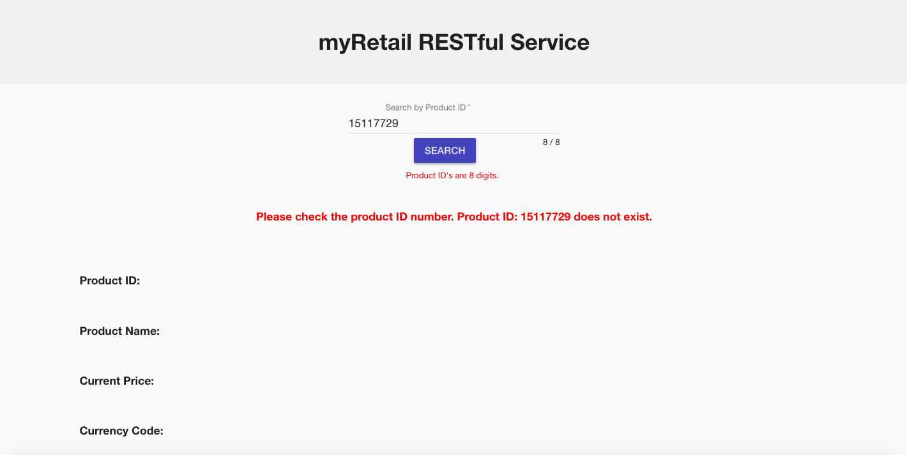

# myRetail RESTful Service

myRetail is a rapidly growing company with HQ in Richmond, VA and over 200 stores across the east coast. myRetail wants to make its internal data available to any number of client devices, from myRetail.com to native mobile apps.

The goal for this exercise is to create an end-to- end Proof-of- Concept for a products API, which will aggregate product data from multiple sources and return it as JSON to the caller.

Your goal is to create a RESTful service that can retrieve product and price details by ID. The URL structure is up to you to define, but try to follow some sort of logical convention.

[Click here for a live demonstration of this application](https://morning-oasis-48913.herokuapp.com.)

## Built With

- MongoDB
- Express
- AngularJS 
- Node.js
- axios
- Chai and Chai-HTTP for testing
- AngularJS Material for styling
- apidocjs for API Documentation

## Getting Started

These instructions will get you a copy of the project up and running on your local machine for development and testing purposes. 

### Prerequisites

- [Node.js](https://nodejs.org/en/)
- [Mongo](https://www.mongodb.com/download-center?jmp=tutorials&_ga=2.157987642.1691954874.1515639811-1798030591.1515639811#enterprise)
- Start Mongo and make sure it is up and running.

### Installing

Steps to get the development environment running.

1. Download this project.
2. `npm install`
3. `npm start`
4. Insert following test cases into MongoDB:
```javascript
    {
    "_id" : ObjectId("5a866b825079c35e229105b1"),
    "product_id" : 16696652,
    "current_price" : {
        "currency_code" : "USD",
        "value" : 113.99
    }
}
{
    "_id" : ObjectId("5a8674d25079c35e22910836"),
    "product_id" : 13860428,
    "current_price" : {
        "currency_code" : "USD",
        "value" : 13.99
    }
}
```

## Documentation and Testing

Tests are located in server/tests/server.test.js.

Test can be run by executing npm test.

API documentation is located at localhost:5000/apidoc or on the live demo /apidoc - [click here](https://morning-oasis-48913.herokuapp.com/apidoc/).

## Screen Shot




### Completed Features

High level list of items completed.

- [x] Responds to an HTTP GET request at /products/{id} and delivers product data as JSON (where {id} will be a number.
- [x] Performs an HTTP GET to retrieve the product name from an external API. (For this exercise the data will come from redsky.target.com, but let’s just pretend this is an internal resource hosted by myRetail)
- [x] Reads pricing information from a NoSQL data store and combines it with the product id and name from the HTTP request into a single response.
- [x] Accepts an HTTP PUT request at the same path (/products/{id}),
containing a JSON request body similar to the GET response, and updates the product’s price in the data store.

## Author

* Marta Jopp